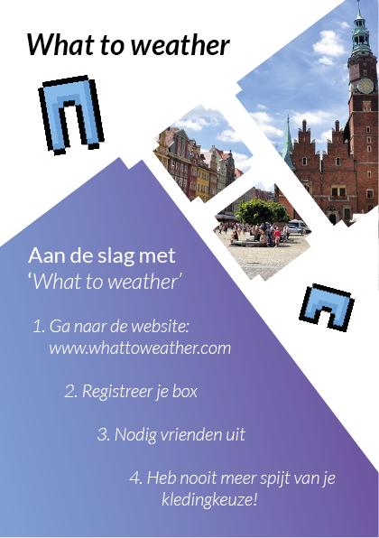
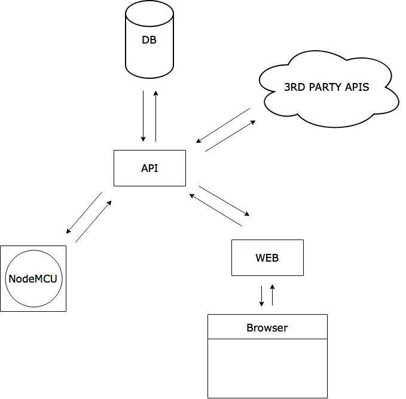

## Project: What to Weather
We created a box that shows the windchill temperature of the day. The windchill will be displayed with pants for cold weather and shorts for warm weather. We decided that everything under the 20 degrees celsius is cold and everything above 20 degrees celsius is warm. 

But why make this? We all have that moment when we look outside and we can't decide what to wear. This 'What to Weather' box solves the problem.

First the user needs to make an account on the web app. Here they declare their name, NodeMcu ID and a color. The color will be used to show the other users who is wearing what.

After the user has seen what kind of weather it is, they can share what they want to wear with their friends. By turning a button (potentiometer) they can select shorts or pants. By pressing on the big red button the user sees if they should wear shorts or pants. By shaking the box you can see what others are going to wear.


### Functionality
- Feedback of the windchill 
- Sharing with friends what what the user is going to wear

### Sensors used
- Colorduino v1.3
- Led Matrix 8x8
- Button
- Tilt Sensor
- Potentiometer

### Nice to have
- Make the user able to declare what warm and what cold weather is in the web app
- Add more clothing to send to friends (skirts, dresses)
- Send voice messages


----

## Architecture


## How to install
- [App](#app)
- [NodeMCU](#nodemcu)


## [App](#app)
First clone the repo:
```git
git clone https://github.com/nickrttn/korte-broek-weer.git
```

After that:
```git
npm install
```

Create an .env file with these variables:
```javascript
PORT= portnumber
APIKEY= weather api key
WEATHERMAP_ENDPOINT= weather api url
POLLING_RATE= number of miliseconds in which the api must be called
COUCHDB_ENDPOINT= database endpoint
ENDPOINT= endpoint to api server
```

Now start up the server:
```git
npm start
```

## NodeMCU(#nodemcu)
See: [NodeMCU README](https://github.com/nickrttn/korte-broek-weer/tree/master/arduino)
